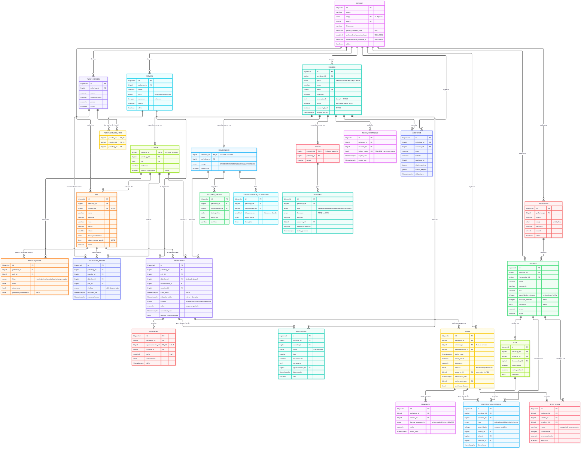

# Modelo Entidade-Relacionamento — PetPlus

Derivado do **Diagrama de Classes** (`Documentação/diagrama_de_classes_PetPlus.pdf`)
e dos **Requisitos** RF01–RF30 / RN01–RN12 do documento de segunda entrega.

- **Fonte editável:** [`diagramas/mer.mmd`](diagramas/mer.mmd) (Mermaid)
- **Detalhe coluna a coluna:** [`dicionario-de-dados.md`](dicionario-de-dados.md) — gerado do banco real
- **DDL:** [`sql/`](sql/)

**Legenda das cardinalidades:** `1` exatamente um · `0..1` zero ou um ·
`0..*` zero ou muitos · `1..*` um ou muitos.

---

## 1. Entidades

| Entidade | Significado |
|---|---|
| `petshop` | Unidade de negócio. É o **tenant**: todas as outras entidades pertencem a uma. |
| `usuario` | Qualquer pessoa que acessa o sistema (a classe abstrata do diagrama). |
| `cliente` · `colaborador` · `gestor` | Especializações de `usuario` por perfil. |
| `token_recuperacao` | Token de uso único para redefinir a senha (RF24). |
| `disponibilidade_colaborador` | Janela de trabalho do profissional, por dia da semana. |
| `pet` | Animal do tutor. |
| `registro_saude` | Item da linha do tempo de saúde (RF11). |
| `servico` | Banho, tosa ou consulta. |
| `agendamento` | Marcação de um serviço. |
| `bloqueio_agenda` | Férias, folga ou ausência (RF30). |
| `avaliacao` | Nota do cliente após o atendimento (RF28). |
| `pacote_servico` · `pacote_servico_item` · `assinatura_pacote` | Planos recorrentes (RF29). |
| `fornecedor` · `produto` · `lote` · `movimentacao_estoque` | Estoque. |
| `venda` · `item_venda` · `pagamento` | PDV. |
| `notificacao` · `relatorio` · `auditoria` | Comunicação, exportações e log. |

**26 tabelas.**

---

## 2. As seis decisões que definem este modelo

### 2.1 A classe abstrata `Usuario` vira uma tabela + especialização

O diagrama de classes mostra `Usuario` como abstrata, generalizada em
`Cliente`, `Colaborador` e `Gestor`. Duas formas são possíveis:

| Opção | Problema |
|---|---|
| Uma tabela `usuario` com `perfil` | A que escolhemos. |
| Uma tabela por perfil, com colunas repetidas | `nome`, `email` e `senha` ficariam duplicados em três tabelas — violação da 1FN e três logins para manter. |

A herança foi mapeada como **tabela base + tabelas de extensão 1:1**, com a
chave primária da extensão sendo a própria `usuario.id`. `Cliente` guarda só
`endereco` e `pontos_fidelidade`; `Colaborador` só `cargo` e `matricula`;
`Gestor` só `cargo`. Nada é repetido.

### 2.2 Agendamento tem início **e fim** — é o que viabiliza o RN01

O diagrama mostra `dataHora` (um instante). Com um único instante, dois
atendimentos de 09:00 às 10:00 e 09:30 às 10:30 ficariam "diferentes" e o
conflito passaria.

Por isso existe `data_hora_fim`, preenchida com `início + duracao do serviço`.
Com os dois extremos, o banco impede a sobreposição com uma constraint
`EXCLUDE` (§3.1) em vez de uma comparação ingenua de strings.

### 2.3 O tutor do agendamento é derivado do pet, não informado

`agendamento` tem `cliente_id`, mas a API **não o recebe**: ele é preenchido
pelo banco a partir do pet. Uma FK composta `(pet_id, cliente_id)` →
`pet(id, cliente_id)` garante que "atendimento do pet do cliente A vinculado
ao cliente B" é impossível — não depende de disciplina da aplicação.

### 2.4 Disponibilidade vira entidade, e o texto livre sai

O protótipo guardava `"Seg–Sex, 09h–18h"` numa coluna de texto. Texto livre
que codifica regras é inimigo de índices e de validação.

`disponibilidade_colaborador` guarda **uma linha por (colaborador, dia da
semana)**, com `hora_inicio` e `hora_fim`. A string que o usuário lê na tela
é *derivada* dessas linhas pela view da API — pode mudar o formato à vontade
sem tocar no dado. O RN08 passou a ser verificável: o banco consulta as linhas.

### 2.5 Estoque é uma trilha, não um número

`produto.quantidade_estoque` parece ser o número do estoque, mas guardá-lo
assim cria duas fontes de verdade e nenhum histórico.

O modelo tem `movimentacao_estoque`, append-only: entrada, saída, ajuste e
estorno. `quantidade_estoque` é a **projeção materializada** dessa trilha,
mantida por um gatilho. Consequências:

- toda baixa tem motivo, autor e data (exigência do RNF09, de graça);
- o saldo nunca "some" — ele pode ser reconstruído a partir da trilha;
- o gatilho trava a linha com `UPDATE ... FOR UPDATE` implícito, então duas
  vendas simultâneas do mesmo produto ficam em fila em vez de vender
  estoque que não existe.

### 2.6 Todo dado de negócio tem `petshop_id`, com FK composta

O RNF13 pede multi-tenant. Duas camadas:

1. **Integridade** — FKs compostas `(x_id, petshop_id) → y(x_id, petshop_id)`
   tornam impossível referenciar um registro de outra unidade.
2. **Isolamento** — `Row-Level Security`: a aplicação define
   `app.petshop_id` no início de cada transação e o banco só devolve as
   linhas daquele tenant. Mesmo que a aplicação esqueça um `WHERE`, o
   vazamento entre petshops é bloqueado no banco.

---

## 3. Regras de negócio garantidas pelo próprio banco

Não são validações da aplicação: são o banco recusando a operação. É por
isso que `npm run test:db` consegue prová-las.

| Requisito | Regra | Como é imposta |
|---|---|---|
| **RN01** | Sem dois atendimentos sobrepostos do mesmo profissional | `EXCLUDE USING gist` em `tstzrange(data_hora, data_hora_fim)` com `WHERE status <> 'cancelado'` |
| **RN02** | Venda só com estoque suficiente | `CHECK (quantidade_estoque >= 0)` + `RAISE EXCEPTION` no gatilho de movimentação |
| **RN04** | Cancelar libera o horário | A cláusula `WHERE` do `EXCLUDE` retira o cancelado do conflito |
| **RN08** | Só dentro da disponibilidade | Gatilho que confere dia da semana e intervalo completo |
| **RN09** | Alerta de validade com ≤ 30 dias | View `vw_alerta_validade`, com o prazo vindo de `petshop` |
| **RN11** | Estorno só por gestor e dentro do prazo | Gatilho que lê o perfil do solicitante e `petshop.prazo_estorno_dias` |
| **RN12** | Bloqueio não cobre agendamento confirmado | Gatilho que conta agendamentos no período |
| **RF25** | Pagamento combinado deve cobrir o total | *Constraint trigger* `DEFERRABLE` — roda no `COMMIT`, depois da última forma de pagamento |
| **RNF02** | Senha nunca em texto puro | `senha_hash` com bcrypt; o hash é gerado fora e nunca aceito da API |
| **RNF09** | Log das operações críticas | Triggers de auditoria gravando antes/depois em JSONB |

O RN01 merece nota: `EXCLUDE` é uma **constraint**, não um gatilho. Ela
continua valendo mesmo que alguém desative todos os gatilhos, escreva
direto no banco com `psql` ou contorne a aplicação inteira.

---

## 4. Cardinalidades: decisões e não-óbvvio

| Relacionamento | Cardinalidade | Por quê |
|---|---|---|
| `usuario → cliente/colaborador/gestor` | `1 : 0..1` | Especialização: exatamente uma linha de extensão por perfil. |
| `pet → registro_saude` | `1 : 0..*` | Todo registro pertence a um pet, e um pet pode não ter nenhum ainda. |
| `pet → agendamento` | `1 : 0..*` | Um pet pode nunca ter sido atendido. |
| `agendamento → avaliacao` | `1 : 0..1` | Um atendimento gera no máximo uma avaliação — `UNIQUE(agendamento_id)`. |
| `venda → item_venda` | `1 : 1..*` | Uma venda sem item não é venda. |
| `venda → pagamento` | `1 : 1..*` | Pelo menos uma forma de pagamento (RF25 permite várias). |
| `cliente → assinatura_pacote` | `1 : 0..*` | Um tutor pode ter vários planos. |
| `pacote_servico ↔ servico` | `N : N` | Resolvido por `pacote_servico_item` (relacionamento "inclui" do diagrama). |
| `colaborador → disponibilidade` | `1 : 0..*` | Entidade fraca: a chave natural é `(colaborador_id, dia_semana)`. |
| `produto → movimentação_estoque` | `1 : 0..*` | Um produto recém-criado ainda não tem movimento. |
| `venda → movimentação_estoque` | `0..1 : 0..*` | Entradas manuais não vêm de venda — a FK é nulável. |

---

## 5. Normalização

O modelo está em **3FN**.

### 1FN — valores atômicos

Todas as colunas são escalares. Os dois casos concretos que existiam no
protótipo foram resolvidos:

- `colaborador.disponibilidade = "Seg–Sex, 09h–18h"` era **não atômico**:
  três informações (dias, entrada, saída) num texto só. Virou
  `disponibilidade_colaborador`, uma linha por dia.
- `pacote_servico.servicos = ['Banho Simples', 'Tosa Higiênica']` era uma
  lista dentro da célula. Virou a tabela `pacote_servico_item`.

### 2FN — sem dependência parcial

Todas as tabelas usam chave primária **surrogate** (`id`), exceto as
entidades fracas, cuja chave natural é completa por construção:
`disponibilidade_colaborador` tem PK `id` **e** `UNIQUE(colaborador_id,
dia_semana)`; `pacote_servico_item` tem PK composta `(pacote_id, servico_id)`.
Nenhuma tabela tem atributo que dependa só de parte da chave.

### 3FN — sem dependência transitiva

O caso que mais aparece aqui é `nome` e `email` do tutor. Eles eram
atributos de `Cliente` no diagrama, mas **dependem de `Usuario`**, não de
`Cliente` — guardá-los nos dois lugares criaria inconsistência. Ficaram só
em `usuario`; `cliente` guarda o que é próprio dela (`endereco`,
`pontos_fidelidade`).

Outro caso: `cliente_id` dentro de `agendamento` é redundante em relação a
`pet.cliente_id`. Em vez de stored procedure para manter os dois em acordo,
a coluna foi tornar **derivada** — preenchida pelo banco e travada pela FK
composta do §2.3.

### Redundâncias que permaneceram, de propósito

Duas, ambas justificadas e documentadas no código:

| Onde | Por que fica |
|---|---|
| `item_venda.nome` e `item_venda.preco_unitario` | Congelados no momento da venda. O comprovante de um ano atrás tem de mostrar o nome e o preço **daquele** dia, mesmo que o produto depois seja renomeado ou repriced. Não é inconsistência: é o fato histórico. |
| `agendamento.valor` | Preço do serviço no momento do agendamento, pela mesma razão. |
| `produto.quantidade_estoque` | Cache deliberado da trilha de movimentações (§2.5), mantido por gatilho. `UPDATE … SET quantidade_estoque = quantidade_estoque + …` dentro de uma transação com trava de linha é seguro; o que seria perigoso é permitir a escrita direta. |

---

## 6. Índices

| Índice | Tipo | Objetivo |
|---|---|---|
| `agendamento_sem_conflito_profissional` | GiST parcial | RN01 — o próprio índice **é** a regra de conflito. |
| `agendamento_colaborador_data_idx` | B-tree | Carregar a agenda de um profissional num período (tela principal). |
| `venda_data_idx` | B-tree DESC | Faturamento por período (RF14). |
| `venda_cliente_idx` | B-tree | Histórico de compras do tutor. |
| `movimentacao_produto_idx` | B-tree | Extrato de estoque por produto. |
| `notificacao_usuario_idx` | B-tree | Sino de notificações não lidas. |
| `avaliacao_agendamento_id_key` | UNIQUE | Garante 1 avaliação por agendamento. |
| `usuario_email_key` | UNIQUE | O login identifica a conta em todo o sistema. |
| `disponibilidade_unica` | UNIQUE | Entidade fraca: uma janela por dia. |

A lista completa, com as 54 entradas, está no dicionário de dados.

---

## 7. O que este banco ainda NÃO faz

Transparência sobre o escopo — nenhum destes é bug, é limite conhecido:

- **Não há envio de e-mail.** `notificacao` registra a mensagem que *seria*
  enviada; o disparo real (RF12, RF13) depende de um provedor de e-mail e de
  um agendador (pg_cron, node-cron) que ainda não existem.
- **Não há exportação de arquivos.** `relatorio` guarda os metadados da
  exportação (RF27); gerar o PDF/CSV é trabalho da camada de aplicação.
- **Não há upload de anexos** (foto do pet, comprovante).
- **A geração de PDFs de relatório** e o **envio de notificações** são
  explicitamente os primeiros itens a implementar quando o backend robusto
  for construído — as tabelas e as regras já estão prontas para eles.
